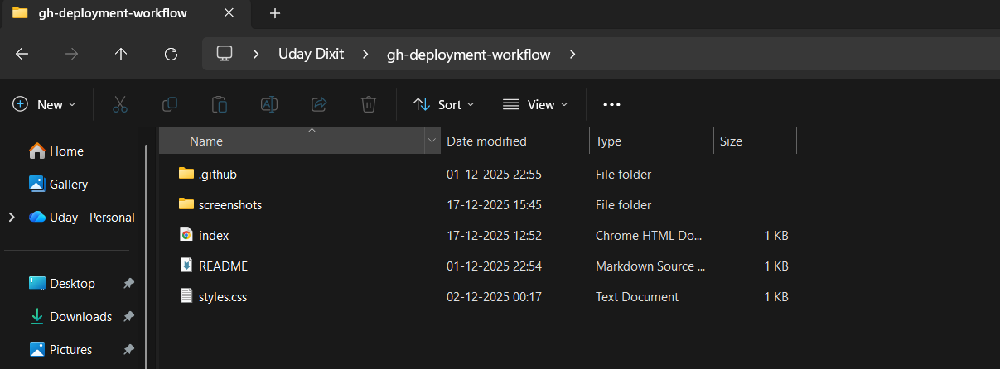
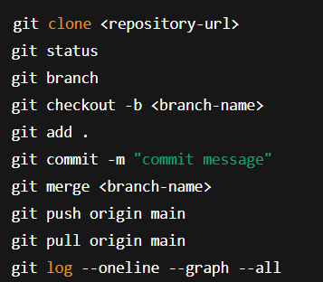
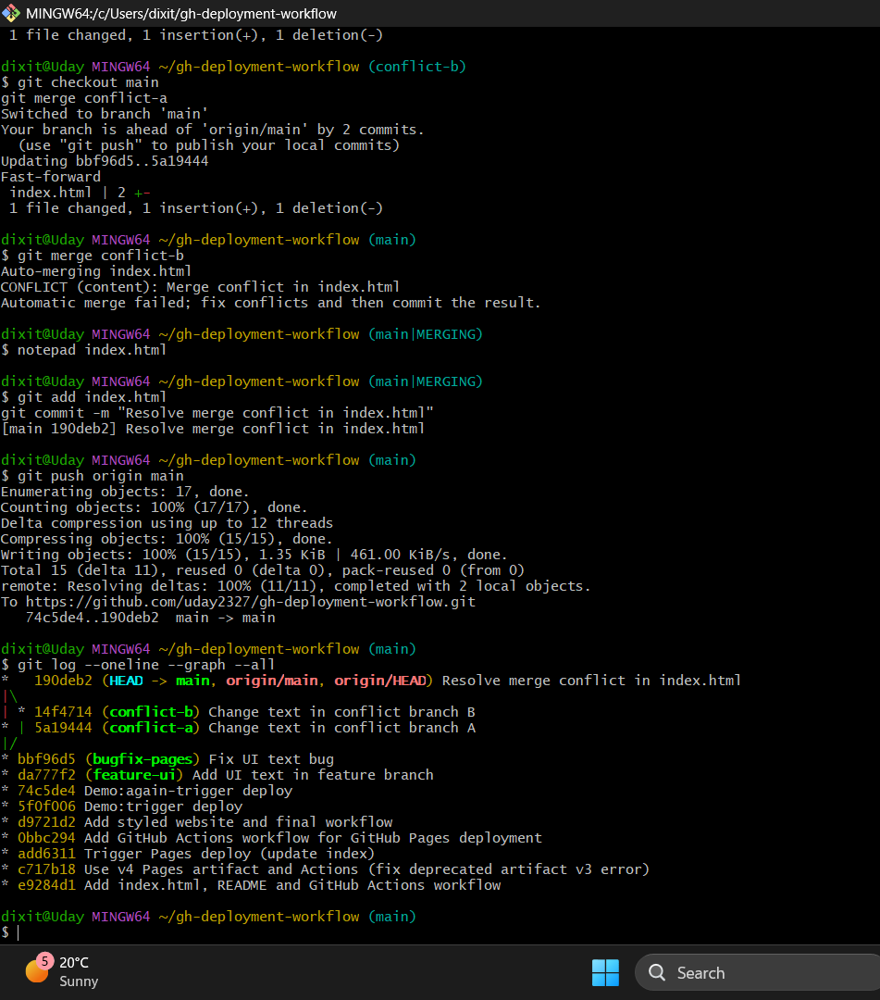

# gh-deployment-workflow
1. Introduction

This project demonstrates the implementation of a CI/CD (Continuous Integration and Continuous Deployment) pipeline using GitHub Actions and GitHub Pages. The main objective of this project is to automate the deployment of a static website so that whenever changes are made to the source code (such as index.html), the website is automatically deployed without any manual intervention.

The project uses Git for version control, GitHub for repository hosting, GitHub Actions for automation, and GitHub Pages for hosting the static website. This project also includes practical usage of Git features such as branching, merging, and merge conflict resolution, which are important concepts in DevOps and software development.

2. Tools and Technologies Used

Git

GitHub

GitHub Actions

GitHub Pages

HTML

CSS

YAML

Git Bash (Terminal)

3. Git Commands Used
git clone <repository-url>
git status
git branch
git checkout -b <branch-name>
git add .
git commit -m "commit message"
git merge <branch-name>
git push origin main
git pull origin main
git log --oneline --graph --all

Explanation:

git clone – Copy repository from GitHub to local system

git status – Check current file status

git branch – View branches

git checkout -b – Create and switch to new branch

git add – Stage changes

git commit – Save changes to Git history

git merge – Merge branches

git push – Upload changes to GitHub

git pull – Fetch updates from GitHub

git log – View commit history and merges

4. Branching and Merge Operations

The project uses multiple branches to demonstrate real Git workflows:

main – Stable production branch

feature-ui – Used for UI changes

bugfix-pages – Used to fix issues

conflict-a and conflict-b – Used to demonstrate merge conflict

A merge conflict was intentionally created by editing the same line in different branches and then resolved manually. This helped in understanding how Git handles conflicts and how developers resolve them in real projects.

5. CI/CD Workflow Explanation

The CI/CD workflow is defined in .github/workflows/deploy.yml.
It performs the following steps:

Detects changes in index.html or styles.css

Checks out the source code

Configures GitHub Pages

Uploads website files as artifacts

Deploys the site automatically to GitHub Pages

The workflow uses the latest v4 GitHub Actions, ensuring stability and security.

6. Screenshots
## Screenshots

### Repository Structure

### Git Commands & Branches

### Merge Conflict Resolution

### GitHub Actions Success

### Live Website

7. Challenges Faced

During this project, the following challenges were faced:

GitHub Pages returned a 404 error because Pages was not enabled

Workflow failed due to deprecated v3 GitHub Actions

Merge conflicts occurred when multiple branches modified the same file

Files were saved incorrectly as .txt instead of .html

All issues were resolved by enabling GitHub Pages, updating to v4 actions, manually resolving conflicts, and correcting file extensions.

8. Project Outcomes

Clear understanding of CI/CD pipelines

Practical experience with Git branching and merging

Ability to debug GitHub Actions workflows

Knowledge of automated deployment using GitHub Pages

Improved confidence in DevOps fundamentals

9. Conclusion

This project successfully demonstrates how CI/CD pipelines automate the deployment process using GitHub Actions and GitHub Pages. By implementing branching strategies, merge conflict resolution, and automated deployment, this project reflects real-world DevOps practices. It provided valuable hands-on experience in version control, automation, and troubleshooting, making it a strong foundation for advanced DevOps and cloud projects.

URL: https://<uday2327>.github.io/gh-deployment-workflow/
